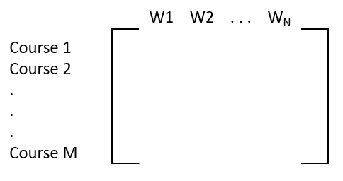

# SkillMapper - Course Analysis

## Issues to address:

* Commodification of courses
    * Too many courses to pick from
* Limited *exposure* to reviews
    * Too many reviews
    * Good reviews always on top
* High search time
    * Comparing multiple courses
    * Caused by the 1st issue


## Possible approaches:

1. Top-words and Wordcloud representation
2. Sentiment analysis
3. TF-IDF Approach
4. Cosine similarity using spaCy

### 2. Sentiment Analysis

[Source](https://investigate.ai/investigating-sentiment-analysis/comparing-sentiment-analysis-tools/)

#### 2.1 Using TextBlob

* TextBlob by default uses `PatternAnalyzer` based on `pattern` library.
* Adjectives hand-tagged from customer reviews
    * Polarity and subjectivity values
    * Source of words - product reviews

#### 2.2 Using TextBlob + `NaiveBayesAnalyzer`
* ML technique, score calculated automatically
* It's basically an NLTK classifier trained on a movie reviews corpus
* Source of words - movie reviews

#### 2.3 Using NLTK
* NLTK is based on VADER
* VADER - a big list of words hand-tagged
    * Each word has  a sentiment rating associated with it
    * Source of word - from all sorts of places

### 3. TF-IDF Approach
* We define a course called "gold course", the course closest to what the user actually likes/wants. The user might've already done this said course and hence likes this course very much.
* We basically try to find a course that is most similar to this course by comparing the reviews.
    * TF will capture the amount of occurrences of each word in a give course.
    * IDF will capture the amount of occurrences of the given said word across all documents (courses).

* `TF * IDF` gives us a matrix of format:

    

* TF-IDF approach essentially calculates and gives weightage, and so it measures ***'relevance'***.

### 4. Cosine similarity

* Based on the cosine of the angle between two vectors.
* spaCy's `similarity()` [function](https://stats.stackexchange.com/a/304341/325775) uses this.

```py
doc_1 = "Data is the oil of the digital economy"
doc_2 = "Data is a new oil"

# Vector representation of the document

# data, digital, economy, is, new, of, the, oil
doc_1_vector = [1, 1, 1, 1, 0, 1, 1, 2]
doc_2_vector = [1, 0, 0, 1, 1, 0, 1, 0]

```
* Better than Euclidean distance
    * Cosine incorporates sense of 'direction'
    * This direction sense can capture 'context'

* Measures 'similarity'

#### 4.1 spaCy's `.similarity()`

* Example usage:

    ```py
    nlp=spacy.load("en_core_web_sm")

    doc_gold = nlp(course_gold_reviews)

    doc1 = nlp(course1_reviews)
    doc2 = nlp(course2_reviews)
    doc3 = nlp(course3_reviews)

    doc_gold.similarity(doc1)
    doc_gold.similarity(doc2)
    doc_gold.similarity(doc3)
    ```

* At backend, `similarity()` returns:
    ```py
    return numpy.dot(self.vector, other.vector) / (self.vector_norm * other.vector_norm) 

    ```
* `vector` is computed using word2vec technique
    * word2vec is based on a NN model